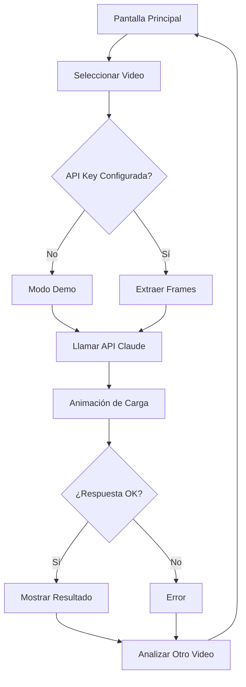

# ⚽ VAR IA - Football Foul Analysis with AI

Aplicación mobile de análisis inteligente de faltas de fútbol usando React Native, Expo y Claude 3.5 Sonnet Vision API.

## 🎯 Características

✅ **Selección de videos** - Carga clips de video de tu galería  
✅ **Extracción de frames** - Extrae 3-4 frames clave del video  
✅ **Análisis con IA** - Claude evalúa como árbitro experto (Law 12 FIFA)  
✅ **Animación de carga** - Radar interactivo mientras se procesa  
✅ **Veredicto estructurado** - JSON con falta/amarilla/roja/juega  
✅ **Modo Demo** - Prueba sin API Key configurada  
✅ **Interfaz profesional** - Tarjetas bonitas y responsivas

## 📋 Requisitos Previos

- **Node.js**: v18 o superior
- **npm** o **yarn**
- **Expo CLI**: `npm install -g expo-cli`
- **API Key de Anthropic**: [Obtén una aquí](https://console.anthropic.com/)

## 🚀 Instalación Rápida

### 1. Instalar dependencias

```bash
cd /Users/victorhermosillo/BorderHack_2026

# Instala todas las dependencias
npm install

# Instala dependencias específicas de Expo
npx expo install expo-image-picker axios expo-media-library
```

### 2. Configurar API Key

```bash
# Copia el archivo de ejemplo
cp .env.example .env.local

# Abre .env.local y reemplaza con tu API Key de Anthropic
# EXPO_PUBLIC_ANTHROPIC_API_KEY=sk-ant-tu-api-key-aqui
```

**¿Cómo obtener API Key?**

1. Ve a [console.anthropic.com](https://console.anthropic.com/)
2. Crea una cuenta
3. Genera una nueva API Key
4. Pega el valor en `.env.local`

### 3. Ejecutar la aplicación

```bash
# Opción A: En Expo Go (más rápido para desarrollo)
npm start

# Luego presiona:
# - 'i' para iOS
# - 'a' para Android
# - 'w' para Web

# Opción B: Build para iOS (requiere macOS)
npm run ios

# Opción C: Build para Android
npm run android

# Opción D: Web
npm run web
```

## 📁 Estructura del Proyecto

```
BorderHack_2026/
├── app/                          # Rutas de Expo Router
│   ├── _layout.tsx              # Layout principal
│   └── (tabs)/
│       ├── _layout.tsx          # Layout de tabs
│       └── index.tsx            # Pantalla principal (VAR IA)
├── screens/
│   └── FoulAnalysisScreen.tsx   # Pantalla principal de análisis
├── components/
│   ├── VideoSelector.tsx        # Selector de videos
│   ├── LoadingRadar.tsx         # Animación de carga
│   └── ResultCard.tsx           # Tarjeta de resultados
├── services/
│   ├── apiClient.ts             # Integración con Claude API
│   └── videoProcessor.ts        # Procesamiento de videos
├── types/
│   └── index.ts                 # Tipos TypeScript
├── utils/
│   ├── config.ts                # Configuración de la app
│   └── mockData.ts              # Datos de prueba (modo demo)
├── .env.local                   # Variables de entorno (NO SUBIR A GIT)
└── package.json
```

## 🎮 Flujo de la Aplicación



## 🧠 Integración con Claude API

### Prompt del Sistema

La app configura Claude como árbitro FIFA experto en Law 12:

- Contacto entre jugadores
- Severidad de la infracción
- Posiciones en el campo
- Veredicto final (Falta/Amarilla/Roja/Juega)

### Respuesta Esperada (JSON)

```json
{
  "verdict": "FOUL",
  "explanation": "Contacto claro de mano. Penalti.",
  "confidence": 0.95,
  "details": {
    "contact_severity": "high",
    "player_position": "Área de penalti, defensor",
    "ball_position": "En trayecto hacia gol"
  }
}
```

## 🎨 Componentes Principales

### VideoSelector

- Acceso a galería de videos
- Preview del video seleccionado
- Validación de formato

### LoadingRadar

- Animación tipo radar
- Estados de carga con mensajes
- Indicador de progreso visual

### ResultCard

- Muestra veredicto con colores
- Barra de confianza
- Detalles del análisis
- Botón para analizar otro video

## 🔧 Configuración Avanzada

### Cambiar modelo Claude

En `utils/config.ts`:

```typescript
CLAUDE_MODEL: "claude-3-5-sonnet-20241022"; // Cambia aquí
```

### Número de frames

```typescript
VIDEO_FRAME_COUNT: 4; // Aumenta o disminuye frames
```

### Modo Demo manual

```typescript
ENABLE_DEMO_MODE: true; // Fuerza modo demo incluso con API Key
```

## 🧪 Pruebas

### Modo Demo (Sin API Key)

1. Deja `.env.local` vacío o sin configurar
2. Selecciona cualquier video
3. La app devolverá resultados de prueba automáticamente

### Con API Key Real

1. Configura tu API Key en `.env.local`
2. Selecciona un video
3. La app enviará los frames a Claude para análisis real

## 📱 Compatibilidad

- ✅ iOS (Expo Go o compilado)
- ✅ Android (Expo Go o compilado)
- ✅ Web (navegador moderno)
- ✅ Expo Go (desarrollo rápido)

## ⚠️ Limitaciones de Expo Go

- Acceso limitado a funciones nativas
- Videos procesados como archivos base64
- Para procesamiento avanzado de video, usa compilación nativa

## 🛠️ Troubleshooting

### "API Key no configurada"

→ Verifica que `.env.local` existe y tiene `EXPO_PUBLIC_ANTHROPIC_API_KEY=tu-key`

### "No se puede acceder a la galería"

→ Verifica permisos en iOS/Android en settings de la app

### "Video no se carga"

→ Usa formatos MP4, MOV, AVI o WebM

### "Error 401 de la API"

→ Tu API Key es inválida o expirada. Genera una nueva en Anthropic

### "Timeout en la solicitud"

→ La respuesta tarda más de 60 segundos. Intenta con video más corto

## 📝 Variables de Entorno

```env
# REQUERIDO (obtén en https://console.anthropic.com/)
EXPO_PUBLIC_ANTHROPIC_API_KEY=sk-ant-v1-xxxxx

# OPCIONAL
EXPO_PUBLIC_ENV=development
```

## 🤝 Contribuciones

Las contribuciones son bienvenidas. Por favor:

1. Fork el repositorio
2. Crea una rama (`git checkout -b feature/amazing-feature`)
3. Commit cambios (`git commit -am 'Add feature'`)
4. Push a la rama (`git push origin feature/amazing-feature`)
5. Abre un Pull Request

## 📄 Licencia

Este proyecto está bajo licencia MIT.

## 🙏 Créditos

- [Expo](https://expo.dev/)
- [React Native](https://reactnative.dev/)
- [Anthropic Claude](https://www.anthropic.com/)
- [FIFA Laws of the Game](https://www.fifa.com/)

---

**Creado con ⚽ para BorderHack 2026**
